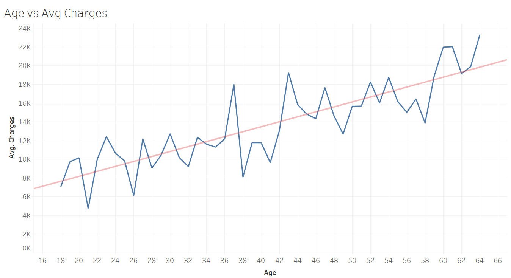
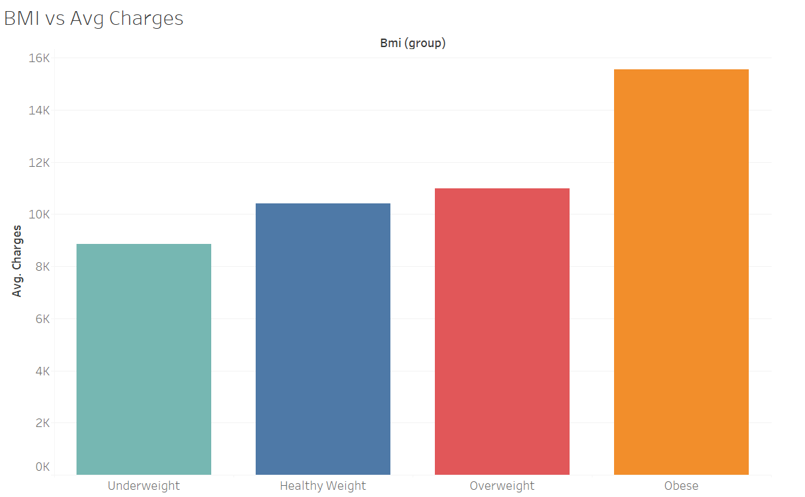
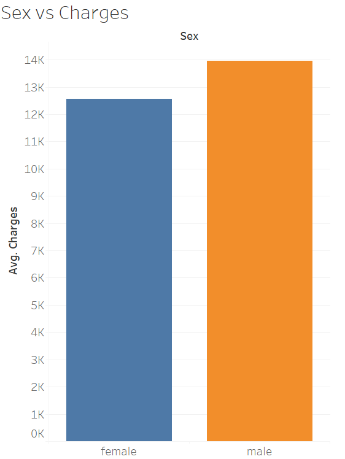
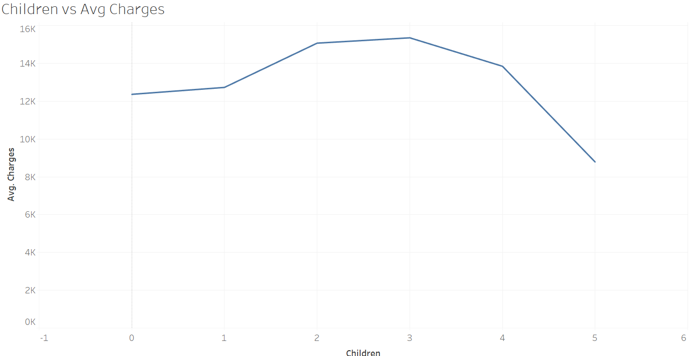
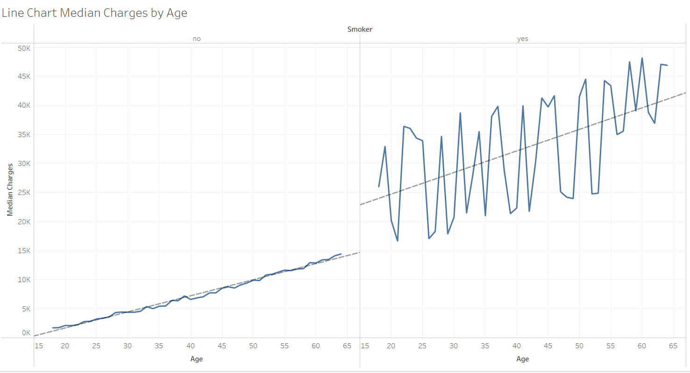
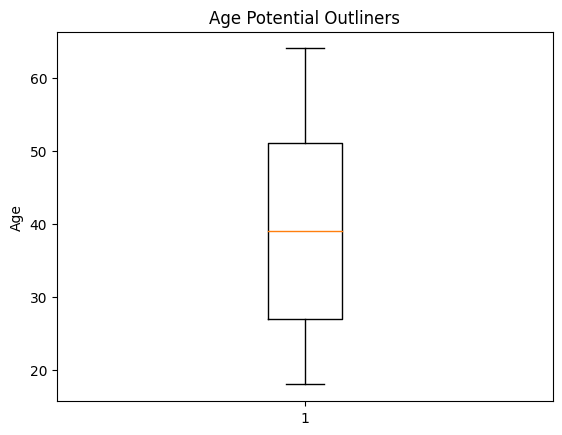
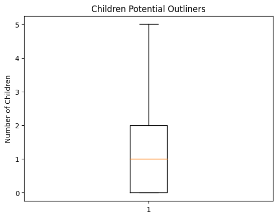
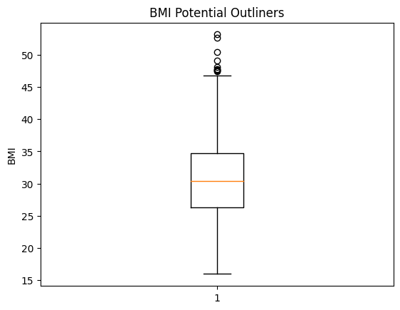
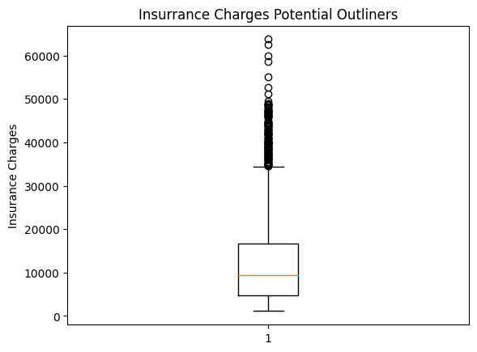

# INSURANCE RATE MACHINE LEARNING
### Contributors:
- Alice Nguyen
- Clover L McLaughlin
- Noah Shore
- Matthew Bond

## Project Overview

The project aims to develop a predictive model for estimating the impact of age, sex, BMI, number of children, and smoking habits of an individual on insurance charges. The team employs Linear Regression, Random Forest, and Neural Network models for data prediction to determine the most effective methodology that yields the optimal prediction results. 

## Topic Background

According to HealthCare.gov, health insurance is set based on these five factors: age, location, tobacco use, individual vs family enrollment, and plan category. Premiums can be up to 3 times higher for older people than younger ones. Where you live also has a big effect on your premiums. Differences in competition, state and local rules, and cost of living account for this. Tobacco users may face premiums up to 50% higher compared to non-tobacco users. Furthermore, insurance plans covering spouses and/or dependents may incur additional charges. Plan categories like bronze, silver, gold, etc., also play a factor, as higher-tier categories tend to cost more but provide lower out-of-pocket costs. 

Under Medicare, an individual's medical history should not affect the plan premium. However, for non-medicare members, insurers can charge higher premiums based on calculated risk. According to HealthAffairs.org, in 2023 the average annual premium for employer-sponsored family health insurance coverage increased 7% from 2022. However, if individuals incur a lot of medical charges in one year, they might face a much higher increase in premiums. In certain segments, there is no rule to limit how much an insurer can increase the premium. Therefore, we included BMI in our model to account for health risks.

## Data Sourcing

The team obtained the healthcare insurance data from Kaggle as a CSV file.

Link: https://www.kaggle.com/datasets/willianoliveiragibin/healthcare-insurance

## Build With
- Spark packages
- Pandas
- OS library
- Matplotlib
- Numpy
- Scikit Learn
- Tensorflow
- Keras

## Data Exploration
The team utilized two methods for data exploration. First, we examined the relationship between insurance rates and other independent variables using various graphs and charts. Subsequently, we employed Jupyter Notebook to execute the ETL process, preparing the dataset for the machine learning phase.

### A. Tableau
The team reviewed the following graphs and charts to understand the relationship between the dependent and independent variables.
Figure 1:

Figure 2:

Figure 3:

Figure 4:

Figure 5:

### B. ETL in Jupyter Notebook
First, the team uploaded the CSV file to an AWS S3 bucket. In Google Colab, we established a notebook and utilized Spark to fetch the dataset from the S3 bucket into the notebook. All columns were initially imported as string data type, prompting us to transform the "age" and "children" columns to integers and the "BMI" and "charges" columns into float data type. Subsequently, we converted the Spark data frame to a Pandas data frame for further analysis.

Second, to identify potential outliers, we generated box plots and whisker plots, then applied the IQR method to detect outliers in our numerical columns. Notably, the "age" and "children" variables exhibited no outliers (Figures 1 and 2, respectively). However, the “BMI” and "charges" variables, representing BMI and insurance charges, displayed 9 and 139 potential outliers (see Figures 3 and 4). We believe that these numbers are not genuine outliers; rather, they accurately reflect the reality that a small segment of the population is less healthy than others, leading to significantly higher insurance charges than the average. 

Figure 1:

Figure 2:

Figure 3:

Figure 4:

Next, we then prepared the data for our models. Because the columns “sex”, “smoker”, and “region” are categorical variables, we employed the OneHotEncoder to generate dummy variables. Subsequently, we eliminated the redundant columns "sex_male" and "smoker_yes". The dataset was then partitioned into training and testing datasets. Additionally, we applied the StandardScaler to normalize our numerical data.

## Data Modeling
### A. Linear Regression
The team selected the linear regression model due to this simplicity and understandability. The team took the following steps to predict data with linear regression methodology:
1. First identified independent and dependent variables
   - Independent variables (age, sex, BMI, number of children, smoker status, and region)
   - Dependent variable (health insurance costs)
2. Next, we fit the data into the model and made predictions
3. Then, we computed the following statistics to determine the relationship between the various independent and dependent variables
   - R square, mean squared error, root mean squared error
4. Ultimately, we eliminate independent variables with minimal impact to enhance the model’s performance.

### B. Random Forest
The team selected the Random Forest machine learning method because of the complex nature of the factors affecting insurance rates. The random forest combines the output of multiple decision trees to reach a single result. Furthermore, random forest performs well when the dataset has potential outliers. 

The team took the following steps to predict data with random forest methodology:
1. Import the random forest regressor module
2. Identify X variables and y variable
   - X variables: age, smoking habit, sex, number of children, region, BMI
   - Y variable: insurance charges
3. Fit the model with the scaled data for the X and y variables
4. Generate the predictions for using .predict on the scaled x text data
5. Compare the predicted cost to the actual cost
6. Use the R square score and mean square error metrics to determine the accuracy of the model

### C. Neural Network
The team chose the neural network model because of its capacity to identify every potential interaction among predictor variables. 
1. Built the model of the first neural network to have 3 layers and use the Relu activation function
2. To calculate the loss function, use Mean Squared Logarithmic Error
3. Create a function to manually calculate the r2 score to use as the metric
4. Using the optimizer “adam”
5. Taking the data that has been split into train and test and fitting the model with the X & y training data
6. Then, use evaluate to determine the accuracy of the model
7. Continue with three more interactions of the model to improve the accuracy
   - Throughout the models, 3 more layers were added as well as the output layer activation function was changed to linear to increase the accuracy of the model. As the models progressed, more epochs for training time were added at 100 epoch intervals per model.

## Model Findings
### A. Multivariate Linear Regression
After evaluating the model, the R-squared was determined to be 0.733. We calculated the coefficients for each of the independent variables used in the model and identified “number of children”, “sex”, and “region” had little explanatory power. The model was performed again after removing these variables to determine how that impacted our R-squared. The R-squared was then determined to be 0.727, further confirming that only including age, BMI, and smoker status in our model would not comprise the predictive nature of our model.

### B. Random Forest
The evaluation of this model yielded an R-squared value of 0.823. This was higher than the desired threshold of 0.8, so this model was not modified in any way.

### C. Neural Network
This model resulted in the most varied R-squared values of the three models. We began with a simple NN using two hidden layers, which resulted in a R-squared value of  -1.3. Then, from that model, we changed the output layer activation function from Relu to Linear and added an additional hidden layer and 100 epochs of training time. This resulted in a lower R-squared value of -1.4. Then, in the next two model variations, we added an additional hidden layer and 100 epochs of training time for a total of 6 layers and 400 epochs of training time. These last two models resulted in R-squared values of 0.6 for each model.

## Conclusion
Achieving an R-square value of 0.82, the team identified the Random Forest as the optimal model for predicting insurance charges based on factors such as age, gender, BMI, smoking habits, and the number of children. This model effectively explains 82% of the variation of the insurance charges using the specified independent variables. Furthermore, We observed that an individual’s smoking habit has the most significant impact on the insurance rate, followed by BMI measure and age. 

## Reference
- https://www.healthcare.gov/how-plans-set-your-premiums/
- https://www.healthaffairs.org/doi/10.1377/hlthaff.2023.00996
- https://thecleverprogrammer.com/2021/10/26/health-insurance-premium-prediction-with-machine-learning/
- https://medium.com/luca-chuangs-bapm-notes/build-a-neural-network-in-python-regression-a80a906f634c
